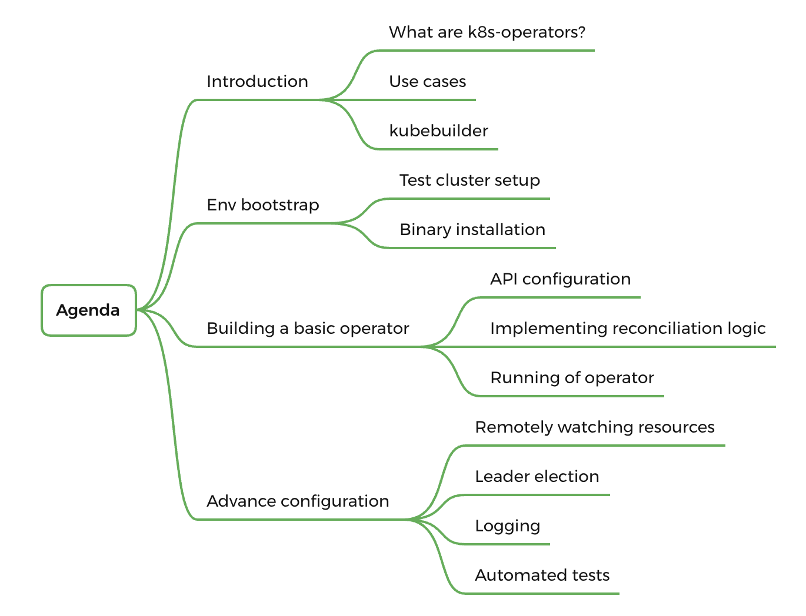

# ohmyk8s-operator
Learn about developing k8s operators using kube-builder.

## What is a Kubernetes Operator?

Kubernetes Operator is an app-specific controller which extends the Kubernetes API to:

- create
- configure
- manage

instances of complex applications. It incorporates the operational knowledge of the application, automating common tasks and facilitation of consistent and standardized way of deploying and running applications.

## Agenda

- [setmeup](./docs/setmeup.md)
- [bootstrap CRD](./docs/crd.md)
- [reconcilliation logic](./docs/logic.md)

