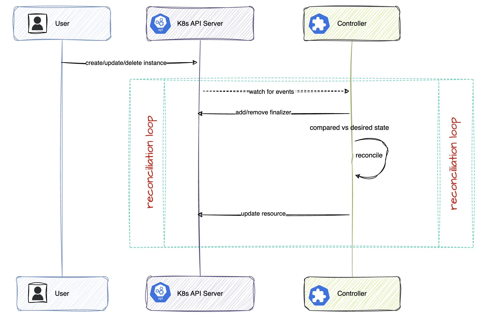

# Controller and reconciliation

### Managers

- Every controller is ultimately run by a Manager(mgr) which is responsible for running controllers, and setting up common dependencies, like shared caches and clients, as well as managing leader election.
- Managers are generally configured to gracefully shut down controllers on pod termination by wiring up a signal handler.

### Controllers

- Controllers use events to eventually trigger reconcile requests. 
- They may be constructed manually, but are often constructed with a Builder (pkg/builder), which eases the wiring of event sources (pkg/source), like Kubernetes API object changes, to event handlers (pkg/handler), like "enqueue a reconcile request for the object owner".
- Predicates (pkg/predicate) can be used to filter which events actually trigger reconciles.

### Reconcilers

- Controller logic is implemented in terms of Reconcilers (pkg/reconcile)
- A Reconciler implements a function which takes a reconcile Request containing the name and namespace of the object to reconcile, reconciles the object, and returns a Response or an error indicating whether to requeue for a second round of processing.



### Reconcile struct

```
type NamespaceconfigReconciler struct {
	client.Client                       # used to read and write Kubernetes objects "sigs.k8s.io/controller-runtime/pkg/client"
	Scheme *runtime.Scheme              # used to convert between different API versions "k8s.io/apimachinery/pkg/runtime"
}
```


## Reconcile function


```
func (r *NamespaceconfigReconciler) Reconcile(
    ctx context.Context,
    req ctrl.Request                    # contains the information about the event that triggered the reconciliation.
    ) (
        ctrl.Result,                    # result that the function returns
        error
    ) {
        // reconcile implementation
    }
```

The reconciliation function is idempotent which means, it can be called multiple times for the same resource, and the result should be the same.


